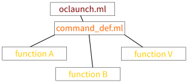

# Source organisation

## Where to start

In order of execution, the first file to be read is `oclaunch.ml`. From this is
called command line argument parsing (in `command_def.ml`). Then, all is
organised in modules, i.e. one file grouping functions used for a given
functionality.

## To Infinity and Beyond

To find your way in modules, read comments explaining the goal of it.      
It's at the start of the file, just after the licence header.

